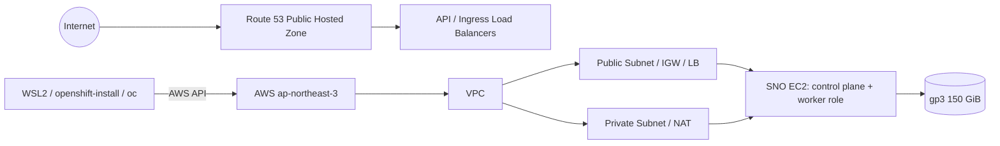

# 全体構成図


```mermaid
flowchart LR
  Admin[WSL2 / openshift-install / oc] -->|AWS API| AWS[AWS ap-northeast-3]
  DNS[Route 53 Public Hosted Zone] --> LB[API / Ingress Load Balancers]
  Internet((Internet)) --> DNS
  AWS --> VPC[VPC]
  VPC --> Pub[Public Subnet / IGW / LB]
  VPC --> Priv[Private Subnet / NAT]
  Pub --> SNO[SNO EC2: control plane + worker role]
  Priv --> SNO
  SNO --> EBS[(gp3 150 GiB)]
```

```text
Client -> Route 53 -> Load Balancer -> OpenShift Router/API -> SNO node
                                      SNO = etcd + API + controllers + workloads
```

