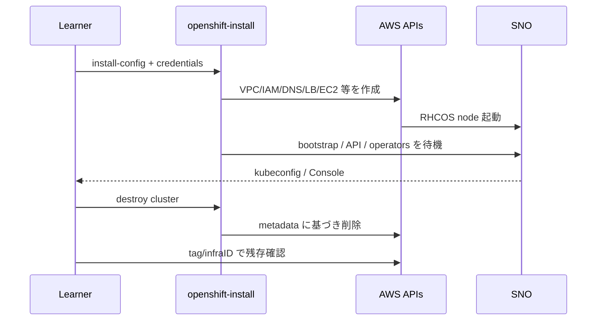

# インストールと削除の流れ

```mermaid
sequenceDiagram
  participant U as Learner
  participant I as openshift-install
  participant A as AWS APIs
  participant O as SNO
  U->>I: install-config + credentials
  I->>A: VPC/IAM/DNS/LB/EC2 等を作成
  A->>O: RHCOS node 起動
  I->>O: bootstrap / API / operators を待機
  O-->>U: kubeconfig / Console
  U->>I: destroy cluster
  I->>A: metadata に基づき削除
  U->>A: tag/infraID で残存確認
```

