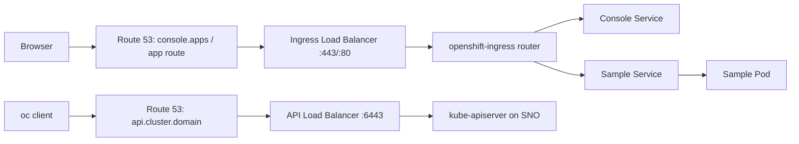

# Console と Route の通信経路

```mermaid
flowchart LR
  Browser --> PublicDNS[Route 53: console.apps / app route]
  PublicDNS --> IngressLB[Ingress Load Balancer :443/:80]
  IngressLB --> Router[openshift-ingress router]
  Router --> Console[Console Service]
  Router --> AppSvc[Sample Service]
  AppSvc --> Pod[Sample Pod]
  OC[oc client] --> APIDNS[Route 53: api.cluster.domain]
  APIDNS --> APILB[API Load Balancer :6443]
  APILB --> API[kube-apiserver on SNO]
```

