# OpenShift 4.21 UPI模擬ラボ

AWS EC2をオンプレミスサーバーに見立て、OpenShift Container Platform 4.21のUser-Provisioned Infrastructure（UPI）を構築する学習用手順です。TerraformでAWS基盤を作成し、AnsibleでDNS、NTP、HAProxy、Proxy、Registry、NFSを構成した後、`platform: none`としてOpenShiftを導入します。

> [!CAUTION]
> このラボはAWS上の正式な本番構成でも、AWS IPIの代替でもありません。AWS Cloud Controller Manager、Machine API、BMC、PXE、物理NIC、VLANなどは再現しません。検証・学習以外へ使用しないでください。

## アーキテクチャ概要

[固定IP・AZ配置・通信フローを含む詳細](docs/01-architecture-and-parameters.md) / [高解像度PNG](diagrams/01-architecture-overview.png) / [Mermaid原本](diagrams/01-architecture-overview.mmd)

## 配布版の適用範囲

このリポジトリは、次の値を前提に検証した**固定プロファイル教材**です。ドメイン、リージョン、CIDR、ホスト名、固定IP、AWS profile名を変更する場合は、[設定方針](configs/README.md)を確認し、Terraform、Ansible、テンプレート、スクリプト、検証条件を一式変更して再試験する必要があります。

| 項目 | 検証プロファイル |
|---|---|
| AWS profile | `openshift-lab` |
| リージョン | `ap-northeast-3` |
| OpenShift | 既定・検証済み `4.21.26` / x86_64 |
| クラスター名 | `ocp` |
| ベースドメイン | `lab.k8study.com` |
| VPC / Client VPN | `10.80.0.0/16` / `10.81.0.0/22` |
| ノード | Control Plane 3台、Worker 3台、3 AZ |
| 管理経路 | AWS Client VPN、相互証明書、split tunnel、2 AZ association |
| 外部通信 | install-configはSquidを指定。NAT/SGでProxyを強制しない。disconnected化は未実装 |
| 終了方法 | Terraformによる全ラボリソース削除と残存検査 |

CIDRが自宅LAN、社内LAN、既存VPC、他VPN、Direct Connect、Transit Gatewayなどと重複する環境では使用できません。Client VPN CIDRはEndpoint作成後に変更できません。

## 検証したクライアント環境

| 項目 | 検証範囲 |
|---|---|
| 管理端末 | Windows 11、WSL2、Ubuntu 24.04系、x86_64 |
| AWS CLI | v2（実機検証時 `2.36.14`） |
| Terraform | 検証時 `1.15.8`（構成上 `>= 1.8, < 2.0`） |
| Ansible | 検証時 `ansible-core 2.21.2` |
| OpenShift CLI / Installer | `oc`と`openshift-install`を既定の正確な`4.21.26`へ統一 |
| 基盤AMI | `ap-northeast-3`の検証済みRHEL 9.6 AMIをrelease単位でID固定 |
| 補助ツール | Bash、OpenSSL 3、jq 1.7系、Git 2.43系、`dig`、SSH |

正確な依存バージョンは[検証バージョン一覧](configs/tested-versions.yaml)を正本とします。上記は互換性を永久に保証するものではありません。構築開始時に[02. AWS・WSL事前準備](docs/02-prerequisites.md)の構築前検査合格と、利用する正確なバージョンを作業記録へ残してください。実装の検証履歴は[検証レポート](docs/validation-report.md)へ分離しています。

`EXPECTED_OPENSHIFT_VERSION`で別patchを明示できますが、それは未検証のprofile変更です。`oc`と`openshift-install`を同じ値に揃えるだけではサポート済みになりません。AMI、release image、手順、静的検査、構築・削除のE2Eを再検証し、検証バージョン一覧を更新してから配布します。

基盤RHEL AMIは`terraform.tfvars`の`rhel_ami_id`で固定します。リリース担当者がOwner、名前、architecture、状態を検証して更新する値であり、利用者が`most_recent`や名前パターン検索で別AMIへ差し替えません。RHCOS AMIは使用中の`openshift-install`から取得し、別途Owner等を検証します。

AMI、Terraform provider、Ansible Collection、コンテナーイメージは配布版で固定しますが、RHELホストへ`dnf`で導入するRPMは、実行時に設定済みRed Hat repositoryが提供するパッケージへ解決されます。このため、異なる実行日のサービスホストをbyte-for-byte同一には再現できません。固定値を更新していないリリースでも、配布候補ごとにクリーンなE2E構築・検証・完全削除を実施します。

## 料金と必要時間

ネットワークApplyからNAT Gateway、Elastic IP、Client VPN、EC2/EBS、Internal NLB、CloudWatch Logsなどの料金が発生します。OpenShiftノード起動後は特にEC2/EBS費用が増えます。停止したEC2にもEBS料金が残り、NAT Gateway、Client VPN、NLBは停止できません。固定料金は掲載しないため、実施前に[AWS Pricing Calculator](https://calculator.aws/)で`ap-northeast-3`の料金を確認してください。

目安は、事前準備1～2時間、AWS基盤30～90分、OpenShift導入45～120分、検証30分以上、削除20～60分です。AWS側の待ち時間やトラブル対応を含めると4時間を超えることがあります。ノード起動からBootstrap削除までを中断しない作業枠として確保してください。

## 開始前に必要なもの

- 支払い方法と十分なService Quotaを持つ、学習専用に分離可能なAWSアカウント
- 事前に承認した12桁のAWS Account IDと、必要権限を持つラボ専用IAM principal
- 同じAWSアカウントから参照できる既存の`lab.k8study.com` Public Hosted Zone
- Red Hatアカウント、利用資格、OpenShift Pull Secret
- Windowsへの管理者権限、WSL2 Ubuntu、AWS Client VPNを導入できる権限
- 競合しないネットワークと、連続した作業時間

IAM権限、ツール導入、DNS、秘密情報の配置は[02. AWS・WSL事前準備](docs/02-prerequisites.md)に記載しています。

## 手順の進め方

READMEは表紙と案内です。ここではコマンドを実行しません。通常構築は、次の番号付きコンテンツを上から順番に開き、各章の完了条件を満たしてから次の番号へ進めます。途中の章から開始したり、後続章を先に実行したりしません。AWSリソース作成後に構築を中止する場合だけ、停止した章から08章へ移動します。

| コンテンツ番号 | 文書 | 実施内容 |
|---:|---|---|
| 00 | [設計判断](docs/00-design-decisions.md) | 対象範囲と設計上の制限を読む |
| 01 | [アーキテクチャとパラメーター](docs/01-architecture-and-parameters.md) | 構成、固定IP、通信経路を読む |
| 02 | [AWS・WSL事前準備](docs/02-prerequisites.md) | ツール、AWS、秘密情報、構築前検査を準備 |
| 03 | [Terraformネットワーク基盤](docs/03-terraform-network.md) | VPC、Subnet、NAT、Routeを構築 |
| 04 | [AWS Client VPN](docs/04-client-vpn.md) | 管理端末からVPCへの接続を構築 |
| 05 | [基盤EC2と基盤サービス](docs/05-infrastructure-services.md) | DNS、NTP、HAProxy、Proxy、Registry、NFSを構築 |
| 06 | [OpenShift UPIインストール](docs/06-openshift-install.md) | OpenShiftクラスターを構築 |
| 07 | [StorageClassと障害試験](docs/07-storage-and-failure-tests.md) | NFSを必須検証し、任意の障害試験を実施 |
| 08 | [完全削除](docs/08-destroy.md) | AWSとローカルのラボ資材を完全削除 |

問題が発生した場合だけ[09. トラブルシューティング](docs/09-troubleshooting.md)を参照し、解消後は停止した番号へ戻ります。[99. 公式資料](docs/99-references.md)は参考情報です。配布担当者向けの作業は[配布物の監査と作成](docs/release-process.md)へ分離しています。

Terraformを変更する各章は、その章内で`Plan作成 → Planの人手レビュー → Apply → 検証`を完結させます。コマンドを一括貼り付けせず、非ゼロ終了、`ERROR`、`FAILED`または想定外のPlanが表示された時点で停止してください。

## 主要な安全ルール

- Pull Secret、AWS access key、SSH/VPN秘密鍵、`.ovpn`、Ignition、kubeconfig、Terraform state/Planをリポジトリや共有ログへ保存しません。
- AWS Account IDはログイン中の値から自動採用せず、管理者が事前承認した値と照合します。
- Terraform workspaceは`default`だけを使用します。Apply/Destroy前に必ず確認します。
- 既存Public Hosted Zoneはdata sourceとして参照し、ラボの削除対象に含めません。
- AWSコンソールでTerraform管理リソースを手動作成・削除しません。
- Bootstrap後のIgnitionを別クラスターへ再利用しません。
- HAProxy/Worker障害試験のrecovery markerが残る状態ではTerraform操作を行いません。
- 作業終了時は[08. 完全削除](docs/08-destroy.md)で、AWSとローカル資材を別々に確認します。

AWS cleanup後のローカル生成物のpreview、隔離、削除も[08. 完全削除](docs/08-destroy.md)に従います。配布作業は構築番号とは分離した[配布物作成手順](docs/release-process.md)を使用します。

## 既知の単一障害点

初期構成のNAT Gateway、Proxy/Registry、NFSは1台です。Client VPNは2 AZへassociateし、HAProxyは2台で片系停止試験を行いますが、環境全体は高可用ではありません。この構成を「本番相当」「完全HA」と表現しません。

NFSデータ、Registryデータ、クラスターのetcdは完全削除時に失われます。必要なデータを退避してからdestroyしてください。

## ライセンスと脆弱性報告

配布条件は[LICENSE](LICENSE)、外部コンポーネントの帰属とライセンスは[THIRD_PARTY_NOTICES.md](THIRD_PARTY_NOTICES.md)を確認してください。秘密情報を含む脆弱性報告は公開Issueへ投稿せず、[SECURITY.md](SECURITY.md)の連絡手順に従います。
