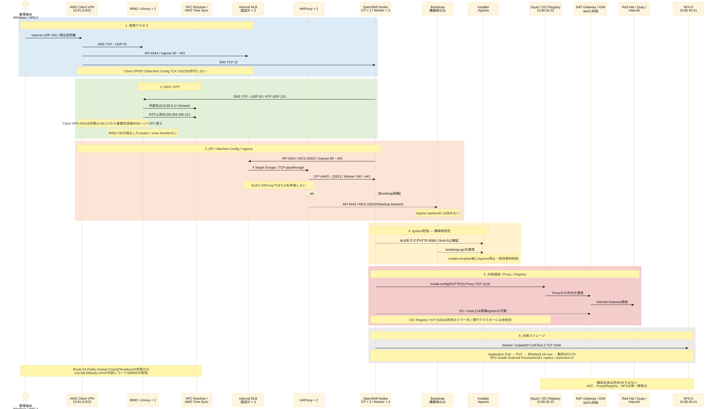

# 01. 構成とパラメーター

## この章の目的

TerraformとAnsibleで共通利用する固定値を確認します。この章は設定ファイルではありません。現行実装は固定プロファイルとして検証されているため、値を変更する場合はコード、テンプレート、スクリプト、検証条件を一式変更して再試験します。

利用者固有値と固定プロファイルの境界は[設定方針](../configs/README.md)を参照してください。

## 全体アーキテクチャ

[高解像度PNG](../diagrams/01-architecture-overview.png) / [Mermaid原本](../diagrams/01-architecture-overview.mmd)

実線は主な通信経路、破線は構築時限定、未統合、参照だけの関係を表します。赤い太枠は意図的な単一障害点です。Bootstrapは構築中だけAPI/Machine Config Serverの予備backendとなり、インストール後にHAProxyとDNSから除外してEC2を削除します。Installer EC2は残りますが、Ignition配信用Apacheとクラスタ固有資材はインストール完了後に停止・削除します。

Route 53 Public Hosted Zoneは存在確認とTerraform data source参照だけに使用し、OpenShiftのプライベートレコードを公開しません。内部の`ocp.lab.k8study.com`はBIND 2台が配信します。図の凡例と再生成方法は[アーキテクチャ図README](../diagrams/README.md)を参照してください。

## ネットワーク

| 用途 | AZ | CIDR |
|---|---|---|
| VPC | 全体 | `10.80.0.0/16` |
| Cluster-a | `ap-northeast-3a` | `10.80.10.0/24` |
| Cluster-b | `ap-northeast-3b` | `10.80.20.0/24` |
| Cluster-c | `ap-northeast-3c` | `10.80.30.0/24` |
| Infra-a | `ap-northeast-3a` | `10.80.40.0/24` |
| Infra-b | `ap-northeast-3b` | `10.80.50.0/24` |
| Infra-c（将来用） | `ap-northeast-3c` | `10.80.60.0/24` |
| Public-a | `ap-northeast-3a` | `10.80.110.0/24` |
| Public-b（予約・現在未使用） | `ap-northeast-3b` | `10.80.120.0/24` |
| Public-c（予約・現在未使用） | `ap-northeast-3c` | `10.80.130.0/24` |
| Client VPN | AWS割り当て | `10.81.0.0/22` |

利用者ごとに、自宅LAN、会社LAN、既存VPC、他のClient VPN、Direct Connect、Transit Gateway、WSL/仮想化ソフトウェアのネットワークと重複しないことを確認します。重複が1つでもある場合、この固定プロファイルをそのまま使用しません。Client VPN CIDRは作成後に変更できないため、Apply前に必ず確定します。

Client VPNのDNSは、基盤構築中はVPC Resolver `10.80.0.2`、BIND完成後は`10.80.40.11`と`10.80.50.11`を使用します。

### AZ・Subnet配置

[高解像度PNG](../diagrams/02-network-az-layout.png) / [Mermaid原本](../diagrams/02-network-az-layout.mmd)

Client VPNは`infra-a`と`infra-b`へassociateします。Internal NLBは3個のCluster Subnetへ固定IPを持ち、cross-zone load balancingでHAProxy 2台へ転送します。Cluster/Infra Subnetのdefault routeはすべて`public-a`のNAT Gateway 1台を経由します。`infra-c`と`public-b`、`public-c`は作成しますが、現行構成ではEC2やNAT Gatewayを配置しません。

## サーバーと固定IP

| ホスト名 | 役割 | AZ | Private IP | 固定プロファイル値 | Root volume |
|---|---|---|---|---|---|
| `installer` | Bastion、Installer、Ansible | 3a | `10.80.40.10` | `t3.medium` | gp3 50 GiB |
| `dns-ntp-0` | BIND、chrony | 3a | `10.80.40.11` | `t3.small` | gp3 20 GiB |
| `dns-ntp-1` | BIND、chrony | 3b | `10.80.50.11` | `t3.small` | gp3 20 GiB |
| `haproxy-0` | HAProxy | 3a | `10.80.40.21` | `t3.small` | gp3 20 GiB |
| `haproxy-1` | HAProxy | 3b | `10.80.50.21` | `t3.small` | gp3 20 GiB |
| `proxy-registry` | Squid、Mirror Registry | 3a | `10.80.40.31` | `m6i.large` | gp3 200 GiB |
| `nfs-0` | NFS | 3a | `10.80.40.41` | `m6i.large` | gp3 200 GiB |
| `bootstrap` | 一時Bootstrap | 3a | `10.80.10.30` | `m6i.xlarge` | gp3 120 GiB |
| `control-plane-0` | Control Plane | 3a | `10.80.10.10` | `m6i.xlarge` | gp3 150 GiB |
| `control-plane-1` | Control Plane | 3b | `10.80.20.10` | `m6i.xlarge` | gp3 150 GiB |
| `control-plane-2` | Control Plane | 3c | `10.80.30.10` | `m6i.xlarge` | gp3 150 GiB |
| `worker-0` | Worker | 3a | `10.80.10.20` | `m6i.xlarge` | gp3 150 GiB |
| `worker-1` | Worker | 3b | `10.80.20.20` | `m6i.xlarge` | gp3 150 GiB |
| `worker-2` | Worker | 3c | `10.80.30.20` | `m6i.xlarge` | gp3 150 GiB |

OpenShift公式最小値はBootstrap/Control Planeが4 CPU・16 GiB RAM・100 GB、Computeが2 CPU・8 GiB RAM・100 GBです。安定性を優先し、OpenShiftノードは4 vCPU・16 GiB RAMを初期値にします。gp3は3,000 IOPS、125 MiB/sをTerraformで明示しています。

インスタンスタイプは`terraform/locals.tf`の固定プロファイル値です。変更する場合はAMI、必要vCPU、メモリー、AZ在庫、ストレージ、Terraform Plan、E2E結果を一式再検証します。構築前検査で現行値のAZ別提供状況とService Quotasを検証します。

基盤7台のRHEL 9.6 AMIは`terraform.tfvars`の`rhel_ami_id`へリージョン固有IDを固定します。配布リリースごとにRed Hat Owner、AMI名、x86_64、`available`を検証して更新し、利用者が名前パターンや`most_recent`で自動選択しません。OpenShift NodeのRHCOS AMIは既定の`openshift-install 4.21.26`から取得し、`scripts/06-01-prepare-openshift-install.sh`がOwner、状態、architectureを検証します。

## NLBの固定プライベートIP

| AZ | NLB IP |
|---|---|
| 3a | `10.80.10.5` |
| 3b | `10.80.20.5` |
| 3c | `10.80.30.5` |

BINDではAPI、内部API、IngressのAレコードを上記3アドレスへ向けます。NLBはHAProxy 2台をターゲットにします。

## DNSレコード

正引きゾーンは `ocp.lab.k8study.com`、逆引きゾーンは `80.10.in-addr.arpa` とします。

| 名前 | 種別 | 値 |
|---|---|---|
| `api.ocp.lab.k8study.com` | A | NLB IP 3個 |
| `api-int.ocp.lab.k8study.com` | A | NLB IP 3個 |
| `*.apps.ocp.lab.k8study.com` | A | NLB IP 3個 |
| `bootstrap.ocp.lab.k8study.com` | A/PTR | `10.80.10.30` |
| `control-plane-0.ocp.lab.k8study.com` | A/PTR | `10.80.10.10` |
| `control-plane-1.ocp.lab.k8study.com` | A/PTR | `10.80.20.10` |
| `control-plane-2.ocp.lab.k8study.com` | A/PTR | `10.80.30.10` |
| `worker-0.ocp.lab.k8study.com` | A/PTR | `10.80.10.20` |
| `worker-1.ocp.lab.k8study.com` | A/PTR | `10.80.20.20` |
| `worker-2.ocp.lab.k8study.com` | A/PTR | `10.80.30.20` |

アプリケーションWildcardにPTRは不要です。API用NLB IPのPTRは`api`と`api-int`を登録し、両BINDで検査します。Bootstrap A/PTRは`bootstrap-complete`後に削除します。

BIND 2台は同じzoneファイルをAnsibleで個別配置する独立したmasterです。primary/secondary構成やzone transferによる同期は行いません。

## ロードバランサー

| Listener | 到達元 | HAProxyバックエンド |
|---|---|---|
| TCP 6443 | Client VPN、全ノード | Bootstrap＋Control Plane。完了後Bootstrapを除外 |
| TCP 22623 | VPC CIDRのみ。Client VPNは許可しない | Bootstrap＋Control Plane。完了後Bootstrapを除外 |
| TCP 80 | Client VPN、全ノード | Worker 3台 |
| TCP 443 | Client VPN、全ノード | Worker 3台 |

APIはLayer 4、ステートレス、セッション維持なしとします。`6443` のヘルスチェックは `/readyz`、`22623` は `/healthz`、Ingressバックエンドは `1936/healthz/ready` を基準にします。

## 主な通信フロー

[高解像度PNG](../diagrams/03-communication-flows.png) / [Mermaid原本](../diagrams/03-communication-flows.mmd)

図の番号1から6は独立した通信経路の説明で、すべてが一連の時系列で発生することを意味しません。主な注意点は次のとおりです。

- Client VPNからInternal NLBへ許可するのは`6443`、`80`、`443`で、`22623`は許可しない。
- NLBとHAProxyはTCPパススルーで、TLSを終端しない。
- IgnitionはRHCOSノードがInstallerの`8080/tcp`から直接取得し、NLBを経由しない。
- OpenShiftはinstall-configでSquidを使用するが、Security Groupとrouteは直接NAT経由の外部通信も許すため、Proxyはネットワークレベルで強制されない。
- OCI Registryは将来のミラー先として準備した状態で、現行クラスターのreleaseやCatalog取得には統合していない。
- NFSのmount通信はWorkerのkubeletから`2049/tcp`で発生する。

## OpenShiftネットワーク

| 項目 | 値 |
|---|---|
| Machine network | `10.80.0.0/16` |
| Cluster network | `10.128.0.0/14` |
| Host prefix | `/23` |
| Service network | `172.30.0.0/16` |
| Network type | `OVNKubernetes` |
| Platform | `none` |

## 完了条件

- CIDRが相互および利用場所のネットワークと重複していない。
- 各ホスト、IP、AZ、役割が一意である。
- DNSとロードバランサーの全必須レコード・ポートを説明できる。

すべて満たしたら[02. AWS・WSL事前準備](02-prerequisites.md)へ進みます。
